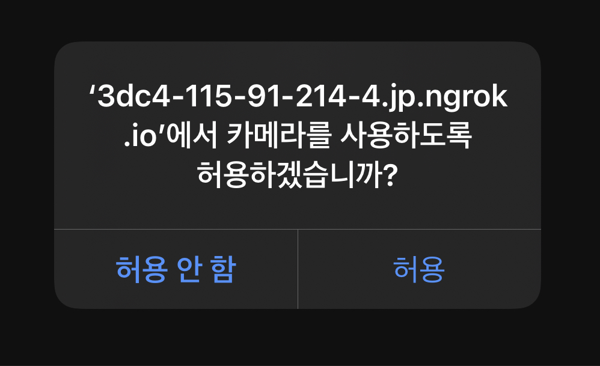

# Import 해야할 모듈들(배치 파일을 못만든 관계로 양해 부탁드립니다)

npm i react-scripts    //
npm i @react-three/fiber    //
npm i @react-three/drei    //
npm i facefilter    //
npm i three    //
npm i merge-images    //

npm i @fortawesome/fontawesome-svg-core    //
npm i @fortawesome/free-solid-svg-icons    //
npm i @fortawesome/react-fontawesome    //

# 2202/03/24 start ~~ #2022/06/03 finish

# FAS (Face Accessary Studio) 에 오신걸 환영합니다!

# 1. 카메라가 잘 되는지 확인해 보세요!

# 2. 자신의 얼굴을 비춰보세요!

# 3. 악세서리를 골라 렌더링 되는지 확인하세요!

# 4. 미리보기를 보고 다운로드를 하거나 NAVER or Kakaotalk에 공유해보세요!

# 이용해 주셔서 감사합니다!

ngrok.exe로 실행하여 확인해보실 수 있습니다.

앱으로 출시하게 되면 따로 공지할께요!